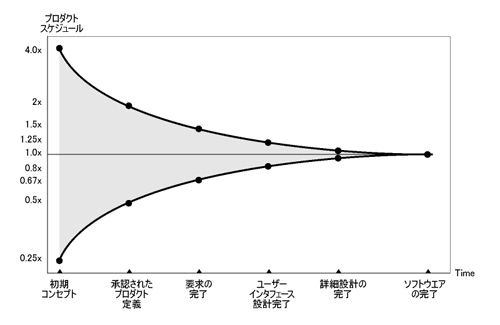

# 【今すぐ活用できる】失敗しないための工数見積もりの手法

  

　　「どうやって具体的な工数を見積もればいいか分からない...」 
　　「見積もったはいいけど、いつもギリギリのスケジュールになってしまう...」
  

このように工数見積もりに対して苦手意識を持っている人も多いのではないでしょうか。
経験を積んだエンジニアでも見積もり作業は難しいものです。
特に新人や経験の浅い人であれば、「本当にこの工数で大丈夫かな？」と不安になることがあると思います。

工数見積もりで一番重要なのは**バッファをどれだけ設けるか**です。
これができると精度の高い、失敗しない工数見積もりができるようになります。

この記事では**工数見積もりの手順とバッファを適切に見積もるためのコツ**を紹介します。
最後まで読んでこれらを理解し、工数見積もりに対する苦手意識を克服していきましょう。

## 工数見積もりをする目的
工数見積もりとは、**その作業を完了させるまでにどれだけ時間(工数)がかかるかを事前に予想する**ことです。
システム開発において工数見積もりを行う目的は大きく2つあります。

- 開発スケジュールを立てるため
- 営業が見積額を算出するため

### 開発スケジュールを立てるため
作業完了までにどれくらい工数が必要か分かれば、開発スケジュールを立てることができます。
ある作業に15時間かかると見積もった場合、1日8時間稼働であれば2日ほど確保してその翌日からは次の作業をいれる、といったスケジュールを立てることができます。
また大掛かりな作業であることが想定されれば、複数人員をその作業にアサインすることも検討できます。

事前に工数が予測できていないと、どれだけ時間を確保しておけばよいか、何人いれば作業が完了するのかが分からず、
スケジュール管理ができない状態になります。

### 見積額を算出するため
多くの場合「**見積額 = 作業に必要な工数 × 基準単価(人月/人日)**」で算出されます。
このようにエンジニアの報酬は労働時間を対価に支払われています。
適切な作業報酬を受け取るためにも、工数見積もりは重要です。

## 「工数見積もりの失敗」とは
「工数見積もりの失敗」とは**当初の見積工数よりオーバーすること**です。
たとえば1週間と見積もっていたが実際には2週間かかってしまえば、「失敗」といえます。

なぜ見積工数よりオーバーすると「失敗」なのか、それはプロジェクト全体で以下の状況に陥る可能性があるからです。

- 納期が延びてしまう
- 開発費が膨れ上がってしまう

### よくある失敗の原因
このような「失敗」が発生する原因はなにか。主な原因として2つあります。

- 感覚だけで考えてしまう
- 適切なバッファを設けていない

#### 感覚だけで考えてしまう
「これくらいで終わるだろう」となんとなく感覚だけで考えてしまうと失敗が起きやすいです。
**感覚だけで出した工数には何の根拠もないから**です。

既に対応したことのある、または類似の作業を行ったことがあるならば、その時の経験を基に算出することもあるでしょう。
しかし過去に経験したことのない作業の工数を感覚だけで考え、根拠のない数値を出してしまうのはリスクが高いです。
そういった場合は即答せず、しっかりと調査をしてから工数を算出するようにしましょう。

#### 適切なバッファを設けていない
作業にトラブルはつきもので、当初想定していなかった対応が入ってしまうこともあります。
その対応工数を想定せずギリギリのスケジュールを組んでいた場合、遅延につながってしまう可能性が上がります。

これら失敗の原因を踏まえながら、工数見積もりの手法と失敗しないためのポイントを見ていきましょう。

## 工数見積もりの基本的な手法
作業の工数の見積もりは、

- 作業をタスクに細分化する
- 細分化したタスクごとに工数を見積もる
- 合算したものを作業全体の工数とする

のステップで行います。
これは**積算法(積み上げ法)**と呼ばれる一般的な手法です。

### 作業をタスクに細分化する
作業全体の工数をまとめて見積もるのではなく、まずは**作業をタスクに細分化**しましょう。
作業完了のためにどんなタスクが必要になるかをリストアップしていきます。
細かいタスクにすることで内容をイメージしやすくなり、より精度の高い見積もりにすることができます。

たとえば「ユーザー登録画面の開発」であれば、これくらいの粒度をイメージしてタスクを挙げていきます。

- 仕様検討
  - DB設計
- 実装
  - 画面作成
  - バックエンド作成
    - 初期表示
    - バリデーション
    - DB登録処理
- レビュー
  - 指摘対応
- テスト
  - テスト仕様書作成
  - テスト実施
  - バグ修正

リストアップに時間をかけすぎる必要はありません。
タスクを完全に洗い出すことは難しいので、不確実なところは後でバッファとして計上するようにしましょう。

### 細分化したタスクごとに工数を見積もる
リストアップできたら各タスクごとにかかる工数を算出します。
過去に似たタスクを行ったことがある場合には、**類推法**という手法が有効です。
類推法は、

  

    「前にやったときは2時間で終わったから、今回も同じくらいだろう」 
    「以前の内容と似てるけど少し複雑だから、今回はその時より工数は多くかかるだろう」
  

といったように、**過去の事例を基にして工数を見積もる手法**です。

タスクによっては「思ったより難しかった」「調べるのに時間がかかった」など想定外のことも起こります。
**作業時のトラブルに対するバッファもタスクごとの工数に含める**ようにしましょう。

#### 初めて行う作業の場合
新人や現場入りたてのエンジニアの場合、過去に似た作業を行ったことがないのが大半です。
その際には焦らず**作業完了のためのシミュレーションを入念に行う**ようにしましょう。

ネットで情報収集したり、周りの人にアドバイスを求めたりしながら、

- どんなタスクが必要になるかをしっかり洗い出す
- それぞれのタスクの内容を自分の頭の中でイメージできるようにする

ことで、だいたいの工数が出せるようになります。
「やったことないから見積もれません」と言うのではなく、自分なりに考えて算出してみることが大切です。

### 合算したものを作業全体の工数とする
各タスクごとの見積もり工数を合算したものが「作業全体の見積もり工数」です。
この手順で算出された工数は、「具体的にどのタスクでどれくらい時間がかかるから、トータルでこれくらいかかる」という根拠に基づいたものです。
自信を持って報告しましょう。

## 「失敗しない」ために、バッファを適切に見積もるコツ
**適切なバッファを設けて予期しない事態に備えておく**ことが、「見積もりで失敗しない」ためには重要です。
バッファを見積もる際に参考になるのが「**不確実性コーン**」です。

### 「不確実性コーン」とは
「不確実性コーン」とは**ソフトウェア開発の各段階での不確実性を示した図**で、
1981年にバリー・ベームが発表し、後にスティーブ・マコネルが命名したものです。

図引用元: [プロジェクトの本質とはなにか 日経XTECH](https://xtech.nikkei.com/it/article/COLUMN/20131001/508039/)

|フェーズ|誤差の幅|
|:---|:---|
|初期コンセプト|4.00〜0.25倍|
|承認されたプロダクト定義|2.00〜0.50倍|
|要求の完了|1.50〜0.67倍|
|ユーザーインターフェース設計完了|1.25〜0.80倍|
|詳細設計の完了|1.13〜0.87倍|
|ソフトウェアの完了|1.00〜1.00倍|

プロジェクトの初期フェーズに近いほど不確定要素が多いため、見積もり工数に対して誤差の幅が大きくなります。
フェーズが進むにつれて不確定要素が減り、最終的な成果物が明確になるため、誤差の幅が小さくなっていきます。

### 不確実性コーンを使ったバッファの算出
不確実性コーンを使ったバッファの算出は以下の流れで行います。

- 「現在はどのフェーズか」「現時点でどこまで決定しているか」を把握する
- 不確実性コーンの図に当てはめて、どれくらい誤差が発生しそうか算出する
- 想定工数に掛け合わせた値を「バッファを含めた想定工数」とする

たとえば先ほどの「ユーザー登録画面の開発」の場合、
画面レイアウトや入力項目まで決定しているのであれば、「ユーザーインターフェース設計完了」の「1.25〜0.80倍」を基にします。
想定工数が10時間だった場合、「10時間 × 1.25 = 12.5時間」と算出することができます。
つまりバッファ2.5時間を想定した工数見積もりになります。

不確実性コーンの数値には下振れも含まれていますが、あくまでもオーバーしないためのバッファなので上振れの数値を参照しています。
「不確定要素がどれくらいあるか」を考えながら、適正な数値をピックアップしてバッファを算出するようにしましょう。

## 見積もった工数を報告するときのポイント2つ
### 前提条件を伝える
不確実性コーンにあったとおり、開発フェーズによって見積もり時には未確定事項が含まれることがあります。
前提事項をつけて見積もりを行わざるを得ないため、報告する際にも「**こういう前提の場合、これくらいの工数だと思います**」と伝えるようにしましょう。
また「**この前提が崩れると大きく工数が変わる**」というポイントがあれば、それも報告に含めると良いです。

### 簡単そうな作業のときは、多くバッファをつけすぎない
常に多くバッファをつけすぎていると、いざ大掛かりな作業の工数を見積もったときに、
「本当にこんなにかかるの？」と思われてしまう可能性があります。
簡単な作業のときには少ないバッファで実工数に近い数値を出しておくと、**大規模な作業の見積もり工数に多めにバッファを積んでも信憑性が増します**。

## まとめ:自分のためにもチームのためにも、見積もりの精度を上げよう
工数を少なく見積もり過ぎてしまい無理のあるスケジュールを組んでしまうと、
決められたスケジュールを間に合わせるために遅くまで作業しなくてはいけなくなったり、
遅延になればチーム全体に影響を及ぼしたりすることに繋がります。

**根拠のある工数見積もりと適切なバッファの設定**を行い、より精度の高い見積もりを出せるようになりましょう。

