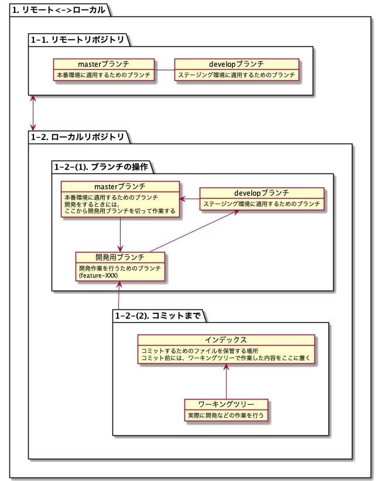

# よく使うGitコマンド
## Gitの全体イメージ


## リモートリポジトリ
### リモート -> ローカル
#### リモートにあるリポジトリをローカルに複製する

```bash
git clone リポジトリURL
```

#### ローカルをリモートの内容で最新化する

```bash
git pull
```

#### リモートブランチをローカルに落とす

```bash
# ローカルのリモート追跡ブランチに持ってきたあと、ローカルにブランチを作成する
git fetch
git checkout -b feature-XXXXXX origin/feature-XXXXXX
```

## ローカルリポジトリ
### ローカル -> リモート
#### ブランチをリモートにpushする

```bash
# 新規ブランチをリモートにpushするとき
git push -u origin feature-XXXXXX

# 一度pushした後は↓だけでいけるはず
git push
```

### ブランチの操作
#### ブランチを切る
開発着手前に、作業用のブランチを作成するときなどに使う。

```bash
# -bオプションをつけると、feature-XXXXXXブランチを作成して、そのブランチに移動してくれる
git checkout -b feature-XXXXXX
```

#### ブランチの切り替え

```bash
# たとえば、「feature-XXXXXX」ブランチに切り替えたいとき。
git checkout feature-XXXXXX
```

### コミットまで
#### コミットしたいファイルをインデックスに登録

```bash
# ファイル指定
git add <ファイル名>

# カレントディレクトリ以下のファイルを登録(.gitignoreで指定されたファイルは除く)
git add .

# Git管理されているファイルのうち、変更されたファイルを全て登録
git add -u

# -uオプションで登録されるファイルと、未追跡のファイル(新規ファイルなど)を登録
git add --all
```

#### インデックスに登録した後

```bash
# インデックスとワークツリーの状態確認
# コミットするファイルが間違いないか確認する
git status

# git addしたファイルをインデックスから全削除
git reset HEAD .

# ファイルを指定してインデックスから削除
# コミットしたくないファイルを除外するために使う
git reset HEAD <ファイル名>
```

#### コミットする

```bash
# viモードでコメントを書いてコミットする
git commit

# 簡単なコメントならこっちでも
git commit -m "commitコメント"
```

#### Gitログ

```bash
# ログを確認
git log

# ブランチを指定して確認
git log ブランチ名
git log origin/ブランチ名

# 各コミットで変更のあったファイル名を表示
git log --name-only

# 1行表示
git log --oneline
```

# その他
## ブランチ関連
### ブランチの削除

```bash
git branch -d [ブランチ名]
git branch -D [ブランチ名]
```

### リモートブランチの削除

```bash
git push --delete origin [ブランチ名]
```

### ブランチ名の変更

```bash
git branch -m <古いブランチ名> <新しいブランチ名>

# 今いるブランチ名を変更するときは<新しいブランチ名>のみを指定
git branch -m <新しいブランチ名>
```

## stash関連
### 未追跡ファイルも含めてstash

```bash
git stash -u
```

### stashされたものの確認

```bash
git stash list
```

### stashされたファイル名を確認

```bash
git stash show <stash名>
```

### stashした内容を復元する

```bash
# 復元のみ
git stash apply stash@{0}

# 復元し、stashを削除する
git stash pop stash@{0}
```

### stashを削除する

```bash
git stash drop <消したいstash名>
```

### コメントをつけてstashする

```bash
git stash save -u "stashのコメント"
```

### 特定のファイルだけstash

```bash
# stash[しない]方のファイルを、git addする
# ↑の後に、`git stash --keep-index` を実行する
git stash --keep-index
```

## revert
### 特定のコミットを取り消す

```bash
git revert <commit>
```

### revert時にコミットせずINDEXに戻す

```bash
git revert <commit> --no-commit

# 内容確認できたら、「git commit」でコミットする。
```

## merge
### マージ

```bash
git merge --no-ff 取り込みたいブランチ名
# git merge --no-ff origin/master
# Merge remote-tracking branch 'origin/master' into hotfix-430
```

### マージはするが、コミットはしない

```bash
git merge --no-commit --no-ff 取り込みたいブランチ名
```

### マージしたけど、やっぱりやめる

```bash
git merge --abort
```

### cherry-pickで特定のコミットを適用する
cherry-pickは、特定のコミットを指定して取り込むことができる。

```bash
git cherry-pick コミットID
```

### cherry-pickでcommitせず、indexへの適用に留める

```bash
git cherry-pick -n コミットID
git cherry-pick --no-commit コミットID
```

## commit関連
### 直近のコミットコメントを編集

```bash
git commit --amend
```

## diff
### 差分

```bash
# コミットID(6099171)の次のコミットから、最新(HEAD)までの差分
git diff --name-only --diff-filter=ACMRTUXB 6099171 HEAD

# 差分抽出されたファイルをzipに圧縮する
git archive --format=zip --prefix=archive/ HEAD `git diff --name-only --diff-filter=ACMRTUXB 6099171 HEAD` -o 20201118_release.zip
```

### 色んな比較の仕方

```bash
# 今回のコミットの変更点を見る
git diff HEAD^

# コミット同士の比較
git diff 変更前のSHA..変更後のSHA

# ブランチ同士の比較
git diff origin/master..origin/hotfix-527
```

