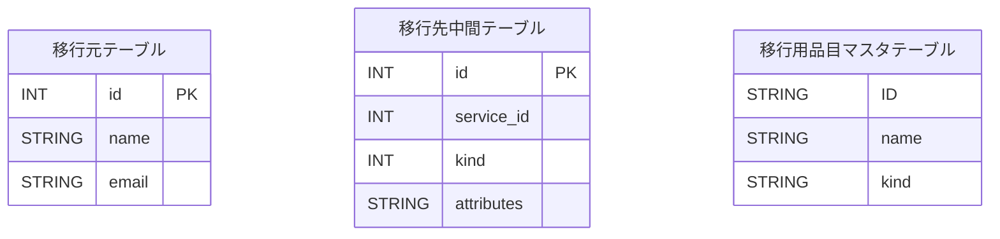
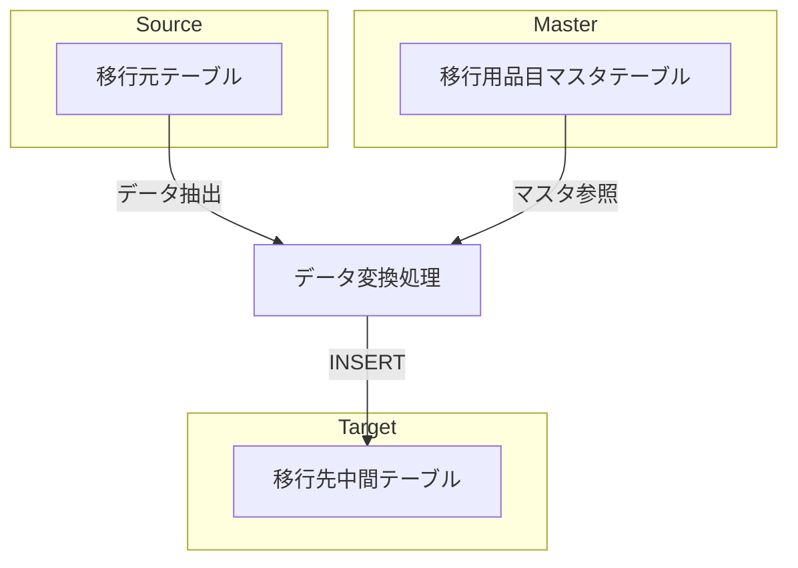
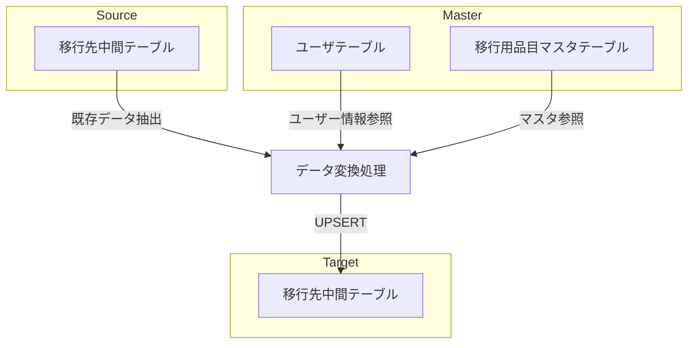

# 関連テーブル

```mermaid
erDiagram
  移行元テーブル {
    INT    id PK
    STRING name
    STRING email
  }

  移行先中間テーブル {
    INT id PK
    INT service_id
    INT kind
    STRING attributes
  }

  移行用品目マスタテーブル {
    STRING ID
    STRING name
    STRING kind
  }
```

# 移行フロー
## 初回移行

```mermaid
flowchart TD
  subgraph Source
    s_table[移行元テーブル]
  end

  subgraph Master
    w_master[移行用品目マスタテーブル]
  end

  subgraph Target
    t_cust[移行先中間テーブル]
  end

  s_table -->|データ抽出| process[データ変換処理]
  w_master -->|マスタ参照| process
  process -->|INSERT| t_cust
```

## 2回目移行
- 「移行先中間テーブル」のデータをSELECT
- ユーザテーブル、移行用品目マスタテーブルをJOIN
- 取得したデータを元に、「移行先中間テーブル」をUPSERT

```mermaid
flowchart TD
  subgraph Source
    s_table[移行先中間テーブル]
  end

  subgraph Master
    w_master[移行用品目マスタテーブル]
    s_user_table[ユーザテーブル]
  end

  subgraph Target
    t_cust[移行先中間テーブル]
  end

  s_table -->|既存データ抽出| process[データ変換処理]
  s_user_table -->|ユーザー情報参照| process
  w_master -->|マスタ参照| process
  process -->|UPSERT| t_cust
```

