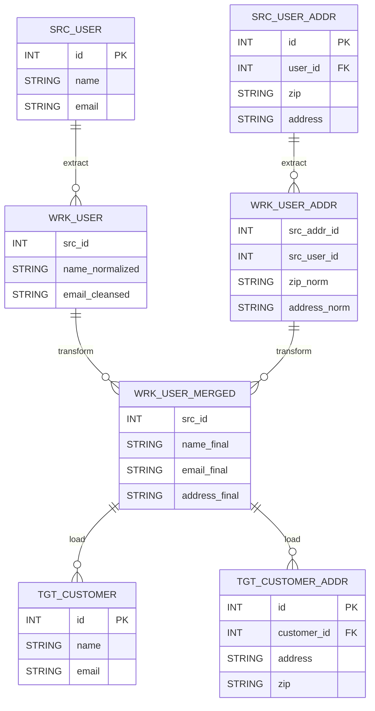
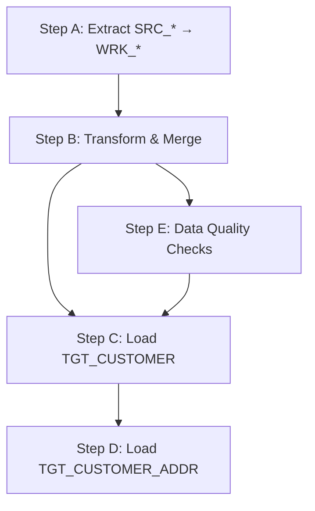

```mermaid
flowchart LR
    %% レイヤをsubgraphで分ける
    subgraph Source [Source (既存DB)]
      s_user[table: SRC_USER]
      s_addr[table: SRC_USER_ADDR]
    end

    subgraph Staging/Work
      w_user[table: WRK_USER\n(正規化/クレンジング)]
      w_addr[table: WRK_USER_ADDR\n(正規化/クレンジング)]
      w_merge[table: WRK_USER_MERGED\n(統合/サロゲートキー割当)]
    end

    subgraph Target [Target (移行先DB)]
      t_cust[table: TGT_CUSTOMER]
      t_addr[table: TGT_CUSTOMER_ADDR]
    end

    %% ステップ（ラベル付きエッジ）
    s_user -->|Extract| w_user
    s_addr -->|Extract| w_addr
    w_user -->|Transform(join/map)| w_merge
    w_addr -->|Transform(join/map)| w_merge
    w_merge -->|Load| t_cust
    w_merge -->|Load(map to FK)| t_addr

    %% 失敗時の巻き戻しやユニーク制約検証など
    w_merge -. precheck: uniqueness/email format .-> t_cust
```




| Target Column           | From (Source/Work)       | Rule/Transform                         | Notes                     |
|-------------------------|--------------------------|----------------------------------------|---------------------------|
| TGT_CUSTOMER.name       | WRK_USER_MERGED.name_final | trim, toTitleCase                      | null禁止                  |
| TGT_CUSTOMER.email      | WRK_USER_MERGED.email_final| lowercase, RFC validation              | 一意制約(UQ)              |
| TGT_CUSTOMER_ADDR.zip   | WRK_USER_MERGED.address_final | regex normalize (NNN-NNNN to NNNNNNN) | ハイフン除去              |
| TGT_CUSTOMER_ADDR.address | WRK_USER_MERGED.address_final | fallback to SRC_USER_ADDR.address      | 空ならSRCにフォールバック |
